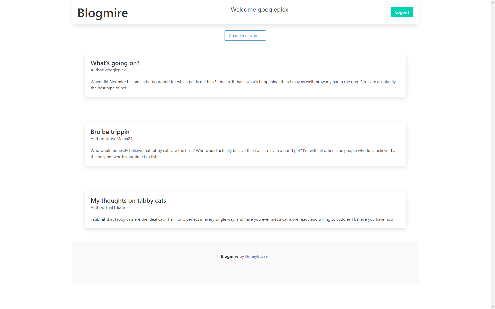

# Blogmire

## Description
Blogmire is a basic blogging/social media framework. This app was designed with a simple UI powered by Bulma, express.js, express-session, handlebars, and mysql2. Blogmire allows users to create an account and post into a general thread. Users can also update their posts and add comments to other users' posts.

## Usage
Here is a picture of the deployed website:

## Credits
The following resources and tutorials were used in creating this project:

* https://www.npmjs.com/package/mysql2
* https://sequelize.org/
* https://www.npmjs.com/package/bcrypt
* https://www.npmjs.com/package/dotenv
* https://www.npmjs.com/package/express
* https://www.npmjs.com/package/express-session
* https://www.npmjs.com/package/handlebars
* https://www.npmjs.com/package/nodemon

The following were contributors who helped with this project:

* Nicki Barrett
* James Dwire
* Dillon Duran
* Jaytee Padilla
* Karina Guerrero
* Tom Gold

## Questions
[Github profile](https://github.com/HoneyBuzz94)

sjohngrow@gmail.com

